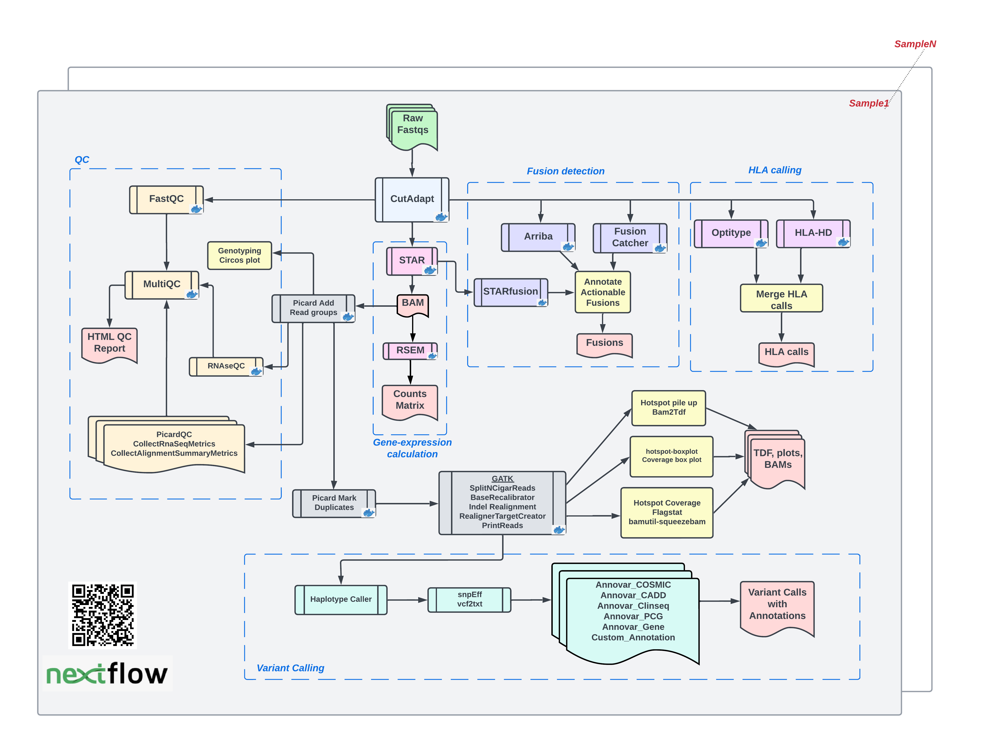

## Introduction


This bioinformatics pipeline is **containerized** and **platform-independent**, built using a **Nextflow DSL2** workflow, and deployed on both the NIH **Biowulf HPC cluster** and the **AWS cloud**.  

This **Exome–RNA-seq workflow** accepts a samplesheet and FASTQ files as input, then performs a comprehensive set of analyses, including:  

- Extensive quality control  
- Mutation calling  
- Tumor mutational burden assessment  
- Mutational signature analysis  
- HLA typing  
- Copy-number variation detection  
- T-cell infiltration prediction  
- Neoantigen prediction  
- Gene expression profiling  
- Fusion detection  
- Variant calling and annotation  

This end-to-end suite supports **deep genomic characterization** for both research and institutional datasets at NIH.  

Results can be explored via the [ClinOmics Data Portal](https://oncogenomics.ccr.cancer.gov/production/public/), which provides a secure, interactive, user friendly web interface for data visualization and interpretation. It is well suited for both individual patient level and cohort wide cancer genomics analysis.


### Who This Is For
This workflow is intended for researchers and bioinformaticians working with exome and RNA-seq datasets who need a reproducible, scalable, and validated solution for comprehensive genomic analysis. It is designed for use in both **HPC** and **cloud computing** environments.  


Here is a Snapshot of our RNAseq and Exome workflows.

### RNAseq Workflow DAG



### Exome Workflow DAG


## Workflow Tools

=== "RNA-seq Tools"
    
    | Stage | Tool(s) | Purpose |
    |-------|---------|---------|
    | Alignment | STAR | Align RNA-seq reads to the reference genome with splice-aware mapping |
    | Strandedness Assessment | ngsderive | Determine library strandedness from aligned BAM files |
    | Expression Quantification | RSEM | Quantify gene and transcript abundance |
    | Post-mapping QC | Picard CollectRNASeqMetrics, RNA-SeQC | Evaluate mapping quality, insert size, and gene body coverage |
    | BAM Processing | GATK SplitNCigarReads, RealignerTargetCreator, IndelRealigner, BaseRecalibrator, PrintReads | Prepare RNA-seq BAMs for variant calling by handling spliced reads, realigning indels, and recalibrating base quality scores |
    | Variant Calling | GATK HaplotypeCaller | Identify germline SNPs and indels from RNA-seq data |
    | Fusion Detection | STAR-Fusion, Arriba, FusionCatcher | Detect gene fusions; integrate consensus calls across multiple tools |
    | HLA Calling | HLA-HD, OptiType | Predict HLA types from RNA-seq data |
    | Variant Annotation | ANNOVAR | Annotate variants with functional consequences and external database references |

=== "Exome Tools"
    
    | Stage | Tool(s) | Purpose |
    |-------|---------|---------|
    | Alignment | BWA-MEM | Align exome reads to the reference genome |
    | BAM QC | Picard CollectAlignmentSummaryMetrics, Picard CollectInsertSizeMetrics | Evaluate mapping quality, duplication rates, and insert size |
    | BAM Processing | GATK MarkDuplicates, BaseRecalibrator, ApplyBQSR | Mark duplicates, recalibrate base quality scores, and prepare BAMs for variant calling |
    | Germline Variant Calling | GATK HaplotypeCaller | Identify germline SNVs and indels |
    | Somatic Variant Calling | Manta, Strelka2, GATK Mutect2 | Identify somatic SNVs and indels |
    | Copy Number Calling | CNVkit | Detect copy number alterations |
    | Variant Annotation | ANNOVAR, SnpEff, VEP | Annotate variants with functional consequences and external database references |
    | T-cell Infiltration Estimation | TcellExTRECT | Estimate tumor-infiltrating T-cell abundance from sequencing data |
    | Tumor Ploidy & Cellularity | Sequenza | Infer tumor purity and ploidy |
    | Microsatellite Instability | MANTIS | Detect microsatellite instability from tumor/normal pairs |
    | Mutational Signatures | SigProfilerExtractor, COSMIC Signature Database | Identify mutational signatures present in the tumor genome |
    | HLA Typing | HLA-HD, OptiType | Predict HLA types from sequencing data |
    | Neoantigen Prediction | pVACseq | Predict candidate neoantigens from tumor-specific variants |
    | Concordance Analysis | Conpair | Verify tumor/normal sample pairing via genotype concordance |

=== "Common Tools"
    
    | Stage | Tool(s) | Purpose |
    |-------|---------|---------|
    | Quality Control | FastQC, MultiQC | Assess raw read quality and generate aggregated QC reports |
    | Contamination Screening | Kraken2, Krona, FastQ Screen | Identify potential contamination from non-target species |
    | Read Trimming | Cutadapt | Remove adapters, low-quality bases, and trim reads for improved alignment |
    | BAM QC & Coverage Analysis | samtools, bamUtils, mpileup, bedtools | Generate hotspot coverage plots, transcript coverage plots, circos plots, and perform BAM compression/clean-up |
    | QC Aggregation | MultiQC | Aggregate QC metrics across all steps into a single interactive report |

## Prerequisites

To run this workflow, you will need the following software:

```
	Nextflow >= 21.04.3
	Singularity 3.10.5
	Graphviz 2.40
```

## Installation

Please clone this repository to your local filesystem using the following command:

```
        git clone https://github.com/CCRGeneticsBranch/Oncogenomics_NF_WF.git
        cd Oncogenomics_NF_WF
```

## Setting up the workflow on biowulf

1. This workflow is hosted on biowulf in khanlab space `/data/khanlab/projects/Nextflow_dev/dev/AWS_POC_MVP_NF`.
2. All the pipeline config can be accessed using `/data/khanlab/projects/Nextflow_dev/dev/AWS_POC_MVP_NF/nextflow.config` file.
3. Within the nextflow.config file you can select the profile to launch the pipeline.`biowulf` profile is preselected in the `nf.sh` script. This is set up to work with biowulf batch resources.
4. Guidelines to create an input samplesheet can be found [here](samplesheet.md).
5. All the references, annotation and bed files are currently located under `/data/khanlab`. We currently support data processing for these capture kits.

### Sequencing capture kits

| RNAseq         | Exome             |
| -------------- | ----------------- |
| Access         | clin_ex_v1        |
| PolyA          | seqcapez.hu.ex.v3 |
| PolyA_stranded | Agilent_v7        |
| Ribozero       | idt_v2_plus       |
| smartrna       | xgen_hyb_panelv2  |
|                | seqcapez_hu_ex_v3 |

If you want to process the data sequenced by other kits, please reach out to [Vineela Gangalapudi](mailto:vineela.gangalapudi@nih.gov).
