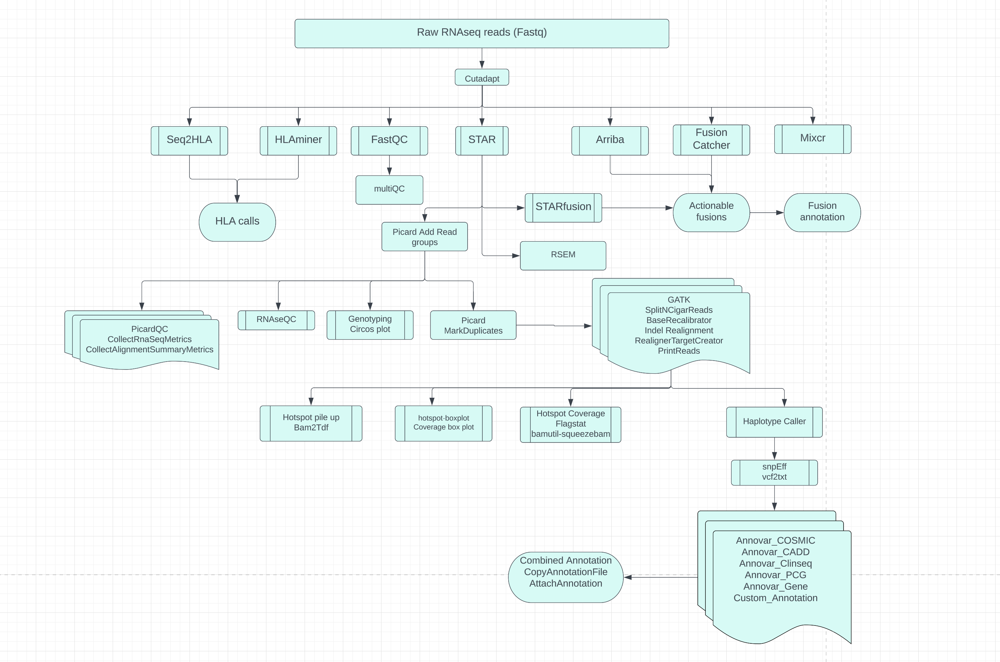

## Overview of the workflow
This RNAseq workflow, based on Nextflow, performs a series of tasks to analyze transcript abundances, identify variants, and perform quality control. It includes 
read trimming, paired-end alignment using STAR, quantification of transcript abundances, fusion calling, variant analysis using GATK, and annotation using Annovar. 



# Prerequisites
To run this workflow, you will need the following software:
```	
	Nextflow >= 21.04.3
	Singularity 3.10.5
	Graphviz 2.40
```


# Installation
Please clone this repository to your local filesystem using the following command:

```
        git clone https://github.com/CCRGeneticsBranch/AWS_POC_Nextflow.git
        cd AWS_POC_Nextflow/ 
        git checkout feature/mvp
```


# Setting up the workflow for Read Trimming and Quantification
1. Obtain the References folder from [box](https://nih.app.box.com/folder/193831680410) and save it to a location that is accessible. Extract the 
`index-STAR_2.7.9a.tar.gz` and `rsem_1.3.2.tar.gz` files. 
2. Modify the references configuration file, `AWS_POC_Nextflow/config/Run_upto_quants_references.config`, by updating the file paths for the references and the 
input directory. The workflow requires all fastq files to be in the same directory.
3. Adjust the cluster requirements in the resources configuration file, `AWS_POC_Nextflow/config/Run_upto_quants_cluster.config`.
4. Update the `runOptions` in the Singularity configuration file, `AWS_POC_Nextflow/config/biowulf_singularity.config`, as appropriate for your cluster 
environment. 
6. Finally, modify the path for the `export OUTDIR` variable in the script `Run_upto_quants.sh`. 

# Running the workflow.
 The workflow can be started by executing the `Run_upto_quants.sh` script in a interactive node. This wrapper script spawns new jobs and submits them to the SLURM 
scheduling system.


 ```
        sh Run_upto_quants.sh         
        This script takes two inputs
        Provide Tag argument - This will add a tag to your resultsdir.
        Provide Run_upto_counts_only argument - It takes value true/false
        example: sh Run_upto_quants.sh projectname true #this will run upto RSEM and generates counts 
        example: sh Run_upto_quants.sh projectname false #this will run the complete pipeline if all the references are added to the config

 ```
The following command should kick initiate the pipeline and display the status.

`sh Run_upto_quants.sh Neuroblastoma_MAQC-III_SEQC true`

When the workflow is launched, it will produce a log that provides information about the pipeline execution, including the command line used, the version of 
Nextflow, the input folder path, the results directory, and the work directory.


```
+] Loading singularity  3.10.5  on cn42722
[+] Loading java 17.0.2  ... 
[+] Loading nextflow 22.10.2
[+] Loading Graphviz v 2.40.1  ... 
NXF_HOME=/data/khanlab3/kopardevn/AWS_MVP_test/results.vg1.2/.nextflow
nextflow run -c /vf/users/khanlab/projects/Nextflow_dev/AWS_POC_Nextflow/nextflow.config -profile Run_upto_quants 
/vf/users/khanlab/projects/Nextflow_dev/AWS_POC_Nextflow/main.nf -resume --run_upto_counts true -with-trace -with-timeline 
/data/khanlab3/kopardevn/AWS_MVP_test/results.vg1.2/timeline.html
N E X T F L O W  ~  version 22.10.4
Launching `/vf/users/khanlab/projects/Nextflow_dev/AWS_POC_Nextflow/main.nf` [crazy_tuckerman] DSL2 - revision: 3e49210bb9
R N A S E Q - N F   P I P E L I N E  
===================================
NF version   : 22.10.4
runName      : crazy_tuckerman
username     : gangalapudiv2
configs      : [/vf/users/khanlab/projects/Nextflow_dev/AWS_POC_Nextflow/nextflow.config, /vf/users/khanlab/projects/Nextflow_dev/AWS_POC_Nextflow/nextflow.config]
profile      : Run_upto_quants
cmd line     : nextflow run -c /vf/users/khanlab/projects/Nextflow_dev/AWS_POC_Nextflow/nextflow.config -profile Run_upto_quants 
/vf/users/khanlab/projects/Nextflow_dev/AWS_POC_Nextflow/main.nf -resume --run_upto_counts true -with-trace -with-timeline 
/data/khanlab3/kopardevn/AWS_MVP_test/results.vg1.2/timeline.html
start time   : 2023-02-09T13:39:52.890203954-05:00
projectDir   : /vf/users/khanlab/projects/Nextflow_dev/AWS_POC_Nextflow
launchDir    : /vf/users/khanlab3/kopardevn/AWS_MVP_test/results.vg1.2
workdDir     : /data/khanlab3/kopardevn/AWS_MVP_test/work.vg1.2
homeDir      : /home/gangalapudiv2
reads        : /data/khanlab/projects/fastq/*_{R1,R2}.fastq.gz

[b5/33c3ef] process > Cutadapt (Test3_R_T)       [100%] 3 of 3, cached: 3 ✔
[70/1fd193] process > Fastqc (Test3_R_T)         [100%] 3 of 3, cached: 3 ✔

```

